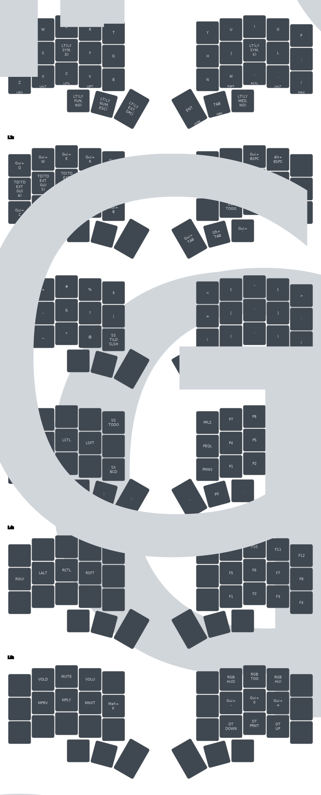

# kōyō

## Introduction

**kōyō** is a sleek, minimalistic keyboard layout, designed with a 34-key split configuration. Its name is inspired by the harmony and elegance of Japanese aesthetics and the calming feeling of autumn leaves.

> In Japanese, **kōyō (紅葉)** translates to "autumn leaves" and is used to describe the phenomenon of leaves changing color in the autumn season. The word is composed of two kanji characters: **kō (紅)** meaning "crimson" and **yō (葉)** meaning "leaf".

## Key Features

- **QWERTY**: Familiar layout to ease the transition.
- **Compact Design**: Comprising only 34 keys, optimized for efficiency and ergonomics.
- **Alpha Keys on Bottom Row**: Easily accessible, with no need to move your hands, and non blocking for for the home row.
- **Utility Extension Layer**: Conveniently located under the space bar, with arrow keys, alphas, and other essential tools.
- **Dedicated Symbol Layers**: Two dedicated layers for symbols for each hand, which are semantically arranged for easy remembrance.
- **Integrated Num Pad**: Enables quick numerical inputs.
- **Functional Key Pad**: Direct access to function keys.
- **Hyper Key Convenience**: Simplifying complex key combinations.

## Layout

## TODO

- [x] Fix Media Keys
- [x] Change default tapping term to 165
- [x] HRM on a Dev Branch ^211d48
- [x] media: Horizontal hierachal order for both sides ^10f058
- [x] scripts: Update qmk script
- [x] sym: Send `~/` on tab
- [ ] scripts(qmk): Update `layout.svg` programmatically
- [ ] source: Use real layer names
- [ ] extend: tabdance
  - tab: a,s,d,f,g -> Cmd(a,s,d,f,g)
- [ ] base: tabdance
  - tab+hold-enter -> hyper
  - tab+hold-backspace -> meh
- [ ] build: compile & flash from here
- [ ] base?: Switch MO(1) & MO(5)
- [ ] media: Screen Brightness
- [ ] Better Umlaute
  - [How do you master umlauts on a 3x5 keyboard? : r/ErgoMechKeyboards](https://www.reddit.com/r/ErgoMechKeyboards/comments/1cmh8ej/how_do_you_master_umlauts_on_a_3x5_keyboard/)

## Resources

- [urob](https://github.com/urob/zmk-config): timeless home row mods
- [infused-kim](https://github.com/infused-kim/zmk-config)
- [miryoku_zmk](https://github.com/manna-harbour/miryoku_zmk)
- [ZMK Docs](https://zmk.dev/docs)
- [Designing a Symbol Layer](https://getreuer.info/posts/keyboards/symbol-layer/index.html)
- [A guide to home row mods](https://precondition.github.io/home-row-mods#shift-thumb-keys)
- [Callum Mods](https://github.com/callum-oakley/qmk_firmware/tree/master/users/callum)
- [Jonas Hietala: I designed my own keyboard layout. Was it worth it?](https://www.jonashietala.se/blog/2023/11/02/i_designed_my_own_keyboard_layout_was_it_worth_it/)
