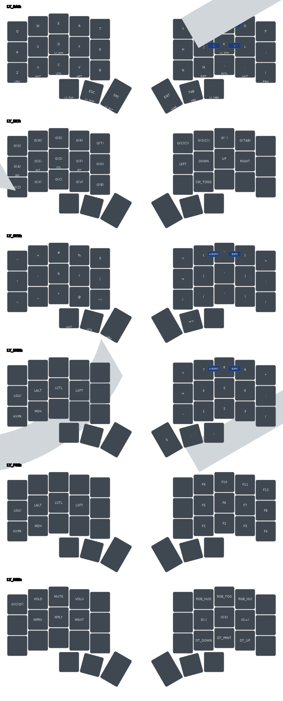

# kōyō


## Introduction

**kōyō** is a sleek, minimalistic keyboard layout, designed with a 36-key split configuration. Its name is inspired by the harmony and elegance of Japanese aesthetics and the calming feeling of autumn leaves.

> In Japanese, **kōyō (紅葉)** translates to "autumn leaves" and is used to describe the phenomenon of leaves changing color in the autumn season. The word is composed of two kanji characters: **kō (紅)** meaning "crimson" and **yō (葉)** meaning "leaf".

## Key Features

- **QWERTY**: Familiar layout to ease the transition
- **Compact Design**: Comprising only 36 keys, optimized for efficiency and ergonomics
- **Alpha Keys on Bottom Row**: Easily accessible, with no need to move your hands, and non blocking for the home row
- **Utility Extension Layer**: Conveniently located under the space bar, with arrow keys, alphas, and other essential tools
- **Dedicated Symbol Layers**: Two dedicated layers for symbols for each hand, which are semantically arranged for easy remembrance
- **Integrated Num Pad**: Enables quick numerical inputs
- **Functional Key Pad**: Direct access to function keys

## CLI Tool

The `koyo` CLI tool provides a streamlined interface for managing your keyboard configurations:

### Installation

```bash
# Clone the repository
git clone https://github.com/nikbrunner/koyo.git

# Run the setup script
./setup.sh
```

### Commands

#### Setup
```bash
# Standard setup
koyo setup

# Dry run to see what would happen
koyo setup --dry-run
```

#### Keyboard Operations
```bash
# Flash Moonlander keyboard
koyo moonlander flash

# Open Moonlander configuration in Oryx
koyo moonlander oryx

# Flash Corne keyboard
koyo crkbd flash
```

#### Update Operations
```bash
# Update layout SVG
koyo update svg

# Update QMK firmware
koyo update qmk
```

### Debug Mode

Add the `--debug` or `-d` flag to any command for verbose output:

```bash
koyo --debug moonlander flash
```

## Layout



## Project Structure

```
koyo/
├── setup.sh           # Setup script
├── utils.sh           # Utility functions
├── qmk/               # QMK configurations
│   ├── moonlander/    # Moonlander specific files
│   └── crkbd/         # Corne specific files
├── help.sh            # Help documentation
├── update_svg.sh      # SVG update script
├── config.yml         # Configuration file
└── assets/           # Project assets
```

## Prerequisites

- QMK Firmware
- `yq` for YAML processing
- ZSH shell
- Git

## Development

### Adding New Features

1. Create a new branch for your feature
2. Implement your changes
3. Update documentation if necessary
4. Submit a pull request

### Testing

Before submitting changes:
1. Test all keyboard configurations
2. Verify CLI commands work as expected
3. Run setup script in dry-run mode

## Resources

- [urob](https://github.com/urob/zmk-config): timeless home row mods
- [infused-kim](https://github.com/infused-kim/zmk-config)
- [miryoku_zmk](https://github.com/manna-harbour/miryoku_zmk)
- [ZMK Docs](https://zmk.dev/docs)
- [Designing a Symbol Layer](https://getreuer.info/posts/keyboards/symbol-layer/index.html)
- [A guide to home row mods](https://precondition.github.io/home-row-mods#shift-thumb-keys)
- [Callum Mods](https://github.com/callum-oakley/qmk_firmware/tree/master/users/callum)
- [Jonas Hietala: I designed my own keyboard layout. Was it worth it?](https://www.jonashietala.se/blog/2023/11/02/i_designed_my_own_keyboard_layout_was_it_worth_it/)

## Contributing

Contributions are welcome! Please read through the existing issues and pull requests before creating new ones.

## License

This project is licensed under the MIT License - see the LICENSE file for details.
